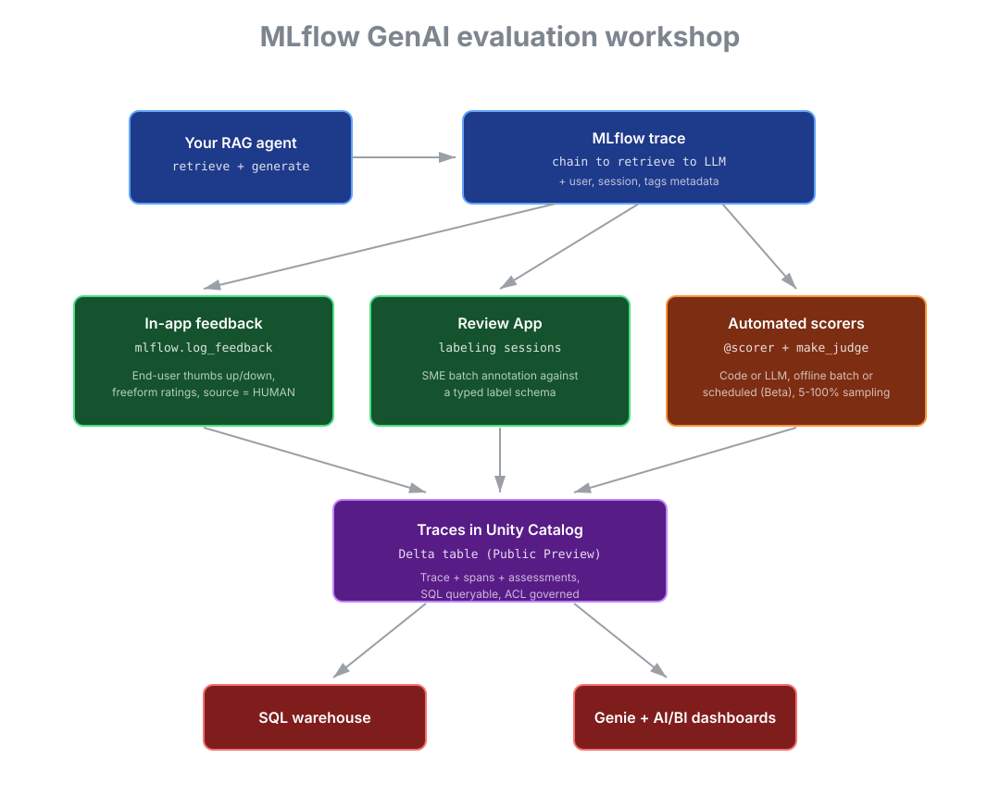

# Build and evaluate GenAI agents on Databricks

A hands-on workshop covering the full MLflow GenAI evaluation surface on Databricks: tracing,
custom scorers, LLM-as-a-judge, human review labeling, scheduled production monitoring, and
OpenTelemetry traces in Unity Catalog.

Seven runnable lessons. About 75 minutes end to end.



## How the data flow works

Every annotation in this workshop ends up as an **assessment** attached to an MLflow trace. Three sources produce assessments and all three write to the same Unity Catalog Delta table:

**1. In-app feedback** (HUMAN, end-users in your app). `mlflow.log_feedback(trace_id, name, value, source=AssessmentSource.HUMAN)` accepts boolean values (thumbs up/down, "was this helpful?"), numeric ratings (1-5 stars, confidence sliders), categorical tags (failure modes like `hallucination`, `missing_context`, `wrong_tool`), and freeform text (what went wrong, what the right answer should have been). Multiple assessments can hang off one trace.

**2. Review App labeling** (HUMAN, SMEs). You define a typed label schema in code (`create_label_schema`) with fields like `factual` (boolean), `answer_relevance` (numeric, 1-5), `failure_mode` (categorical), `rationale` (text). You create a labeling session with a queue of traces. SMEs go through the queue in the Review App UI and fill out every field for every trace. Each filled field becomes a separate assessment. This is your **ground truth**.

**3. Automated scorers** (CODE or LLM). Code scorers do deterministic checks (PII detection, length limits, schema validation, exact string match). LLM judges built with `make_judge` evaluate things humans usually do (groundedness, relevance, safety, custom rubrics). Both run in two modes: offline batch via `mlflow.genai.evaluate(data=..., scorers=[...])`, or scheduled in production via `scorer.register().start(sampling_config=ScorerSamplingConfig(sample_rate=0.1))`.

## How the agent gets better from this data

The point of capturing all this is the loop back to your agent. Five concrete uses, all reading from the same UC table:

- **Eval-set curation**: labeled traces become regression eval sets. Run `mlflow.genai.evaluate(data=labeled_traces, scorers=[...])` whenever you change a prompt, swap a retrieval index, or add a tool. Catch regressions before deploy.
- **LLM judge calibration**: compare LLM judge scores against SME labels on the same traces. If a judge agrees with humans <80%, refine its prompt until it does. Now you can trust the judge to scale to thousands of traces a day where SMEs cannot. Lesson 5 in this workshop walks through `judge.align()`.
- **Failure-mode clustering**: group traces by failure tag and inspect what they have in common. "60% of `hallucination` traces are queries about pricing" tells you to fix retrieval for that topic. SQL plus Genie are how you find these clusters.
- **Few-shot mining**: high-confidence SME-labeled traces become in-context examples in the agent's prompt. Pull them straight out of UC by filtering on assessment values.
- **Fine-tuning sets**: once you have enough labeled traces, fine-tune retrieval embeddings or generation models on the labeled outputs.

This is the closed loop: agent emits traces, signals annotate them, the data drives concrete changes back to agent code. Without the loop, the assessments are dead weight.

## What you'll build

- A small RAG agent emitting structured MLflow traces with session and user metadata
- In-app feedback and SME review labels logged as typed assessments on those traces
- An offline evaluation run with a custom code-based scorer and an LLM-as-a-judge
- Two scheduled scorers monitoring production traces with sampling
- A clear picture of how OpenTelemetry traces flow into Unity Catalog Delta tables and how to query them with SQL

## Prerequisites

- A Databricks workspace with **managed MLflow 3** (default on current runtimes)
- Network access to install `mlflow`, `databricks-sdk`, and `databricks-agents` from PyPI
- A Foundation Model serving endpoint that resolves. The lessons default to `databricks-claude-sonnet-4-6`. Swap to whatever your workspace has if needed (the **Serving** left nav lists what's available).
- Optional: OTel + Traces in Unity Catalog enabled for lesson 7. The other lessons work without it.
- Either serverless compute or an interactive cluster on DBR 14.x or newer

## Quickstart

### Option 1: Databricks Repos (recommended)

1. **Repos** -> **Add Repo** -> paste this repo's URL -> confirm
2. Open `notebooks/00_workshop_introduction` and click through the lessons in order

### Option 2: Manual import

1. Download the repo as a zip
2. In your workspace, **Workspace** -> **Users** -> your username -> **Import** -> upload all files in `notebooks/`
3. Open `notebooks/00_workshop_introduction`

### Option 3: Databricks Asset Bundle (job runner)

```bash
databricks bundle deploy -t dev -p <your-profile>
databricks bundle run mlflow_evals_workshop_pipeline -t dev -p <your-profile>
```

The bundle runs all seven lessons end to end as a multi-task job on serverless compute.

## The lessons

### 1. Pre-flight check

Confirms every API surface the workshop depends on. Eight checks, ~1 minute. Run this first; do not
proceed if any check fails.

[`notebooks/01_pre_flight_check.py`](notebooks/01_pre_flight_check.py)

### 2. Build a traced RAG agent

A small retrieval-augmented agent that emits hierarchical MLflow traces. Demonstrates `@mlflow.trace`,
`SpanType.RETRIEVER` / `SpanType.LLM`, and the `mlflow.update_current_trace` API for session and user
metadata that powers UI filter chips.

[`notebooks/02_agent_app.py`](notebooks/02_agent_app.py)

### 3. Capture human assessments

Two annotation surfaces: in-app feedback (thumbs up/down logged via `mlflow.log_feedback`) and
the Review App for batch SME labeling. Both flow into the same trace assessment surface.

[`notebooks/03_capture_assessments.py`](notebooks/03_capture_assessments.py)

### 4. Run an offline evaluation

`mlflow.genai.evaluate` over a small dataset with a custom `@scorer` function and an LLM judge built
from `mlflow.genai.judges.make_judge`. Results show side-by-side trace comparisons in the eval UI.

[`notebooks/04_offline_evals.py`](notebooks/04_offline_evals.py)

### 5. Calibrate the LLM judge against SME labels

`judge.align(traces)` rewrites the judge's instructions to maximize agreement with human labels.
Pairs every trace that has both a `HUMAN` and `LLM_JUDGE` assessment under the same name, runs
SIMBA (default), GEPA, or MemAlign over the prompt, and produces a new judge object you register
for production use. Closes the loop: SMEs in lesson 3 produce ground truth, lesson 4 runs the
unaligned judge, this lesson aligns the two and reports the agreement lift.

[`notebooks/05_judge_alignment.py`](notebooks/05_judge_alignment.py)

### 6. Schedule scorers in production

Same scorers run two ways: synchronously over a batch of existing traces (immediate scores in the UI),
and continuously over new traces via `scorer.register(...).start(sampling_config=...)`. Beta surface;
sampling controls cost. Picks up the aligned `relevance` judge from lesson 5 automatically.

[`notebooks/06_production_monitoring.py`](notebooks/06_production_monitoring.py)

### 7. Query traces in Unity Catalog

OTel + Traces in UC stores the same trace data in a Delta table that you can query with plain SQL,
point Genie or AI/BI dashboards at, and govern with Unity Catalog. The lesson also walks through the
dual-export pattern for keeping an existing observability tool (e.g. Datadog) in the loop.

[`notebooks/07_otel_uc_integration.py`](notebooks/07_otel_uc_integration.py)

## Feature reference

Each Databricks/MLflow capability used in the workshop, with a one-line role and a docs link.

| Feature | Role in the workshop | Docs |
|---|---|---|
| MLflow tracing (`@mlflow.trace`) | Captures the agent's chain, retrieve, and generate steps as a span tree | [link](https://docs.databricks.com/aws/en/mlflow3/genai/tracing/) |
| Trace metadata (`mlflow.update_current_trace`) | Sets `mlflow.trace.user` / `mlflow.trace.session` so the UI filter chips work | [link](https://docs.databricks.com/aws/en/mlflow3/genai/tracing/track-users-sessions) |
| Feedback assessments (`mlflow.log_feedback`) | Logs typed end-user thumbs up/down on a trace | [link](https://docs.databricks.com/aws/en/mlflow3/genai/getting-started/) |
| Review App labeling sessions | Lets SMEs batch-label existing traces against a typed schema | [link](https://docs.databricks.com/aws/en/mlflow3/genai/human-feedback/concepts/review-app) |
| Custom code-based scorers (`@scorer`) | Any Python function becomes a scorer | [link](https://docs.databricks.com/aws/en/mlflow3/genai/eval-monitor/custom-scorers) |
| LLM-as-a-judge (`make_judge`) | Prompt-based scorer that returns a categorical or numeric value | [link](https://docs.databricks.com/aws/en/mlflow3/genai/eval-monitor/custom-judge/create-custom-judge) |
| Judge alignment (`judge.align`) | Optimizes the judge's instructions against paired SME labels | [link](https://docs.databricks.com/aws/en/mlflow3/genai/eval-monitor/align-judges) |
| Offline evaluation (`mlflow.genai.evaluate`) | Runs scorers over a dataset and produces an eval run | [link](https://docs.databricks.com/aws/en/mlflow3/genai/eval-monitor/) |
| Scheduled scorers (Beta) | Continuous scoring of production traces with sampling | [link](https://docs.databricks.com/aws/en/mlflow3/genai/eval-monitor/run-scorer-in-prod) |
| OTel + Traces in Unity Catalog (Public Preview) | Trace data as a Delta table, queryable with SQL | [link](https://docs.databricks.com/aws/en/mlflow3/genai/tracing/trace-unity-catalog) |
| Foundation Model APIs | Hosts the LLM the agent calls and the judge uses | [link](https://docs.databricks.com/aws/en/machine-learning/foundation-model-apis/) |
| Databricks Asset Bundles | Versioned, deployable wrapper for the workshop notebooks | [link](https://docs.databricks.com/aws/en/dev-tools/bundles/) |

## Repo layout

```
.
├── README.md                                  This file
├── databricks.yml                             Databricks Asset Bundle config
├── workshop_scorers.py                        Reusable scorer module (lesson 6 advanced)
├── images/
│   └── architecture.svg                       Workshop flow diagram
├── notebooks/
│   ├── 00_workshop_introduction.py            Tour notebook (start here)
│   ├── 01_pre_flight_check.py                 Lesson 1
│   ├── 02_agent_app.py                        Lesson 2
│   ├── 03_capture_assessments.py              Lesson 3
│   ├── 04_offline_evals.py                    Lesson 4
│   ├── 05_judge_alignment.py                  Lesson 5
│   ├── 06_production_monitoring.py            Lesson 6
│   ├── 07_otel_uc_integration.py              Lesson 7
│   ├── _resources/
│   │   └── setup.py                           Shared agent + experiment setup
│   └── images/
│       └── architecture.svg                   Diagram (notebook-relative copy)
└── resources/
    └── jobs.yml                               Bundle pipeline job definition
```

## Known operational notes

| Thing | What to know |
|---|---|
| Pip install on serverless | Can stall briefly during the resolver step. Wait an extra 2-3 minutes before interrupting. |
| Lesson 2 trace count | If you use Run-all, the for-loop sometimes flushes only one trace because of how trace logging is buffered between cells. Run cells with Shift+Enter instead, or accept the smaller initial count. |
| Scheduled scorer deserialization | Scorers defined inside notebooks can fail to deserialize on remote workers because their `__module__` resolves to `__main__`. The included `workshop_scorers.py` shows the production-grade pattern: define scorers in a regular Python module file. |
| OTel + Traces in UC region availability | Public Preview; not all regions are supported yet. Confirm availability with your account team before relying on lesson 7's SQL examples. |

## What's next

When you finish the seven lessons:

- Replace the toy corpus in `notebooks/_resources/setup.py` with your own retrieval source (Vector Search index, your Delta table, etc.)
- Replace the eval dataset in lesson 4 with a labeled trace set from your domain
- Run lesson 5 with real SME labels from lesson 3 to actually calibrate the judge
- Tune the sampling rates in lesson 6 to your judge cost budget
- Configure OTel + Traces in UC in your workspace and wire the SQL queries in lesson 7 to your real catalog

## License

MIT. See [LICENSE](LICENSE).
